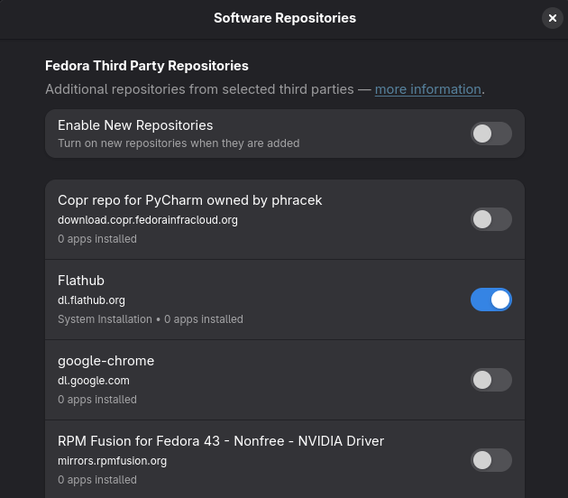
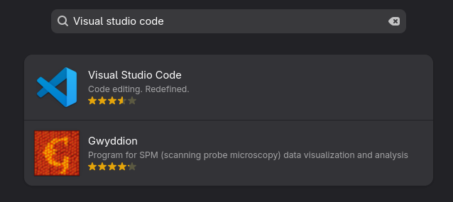
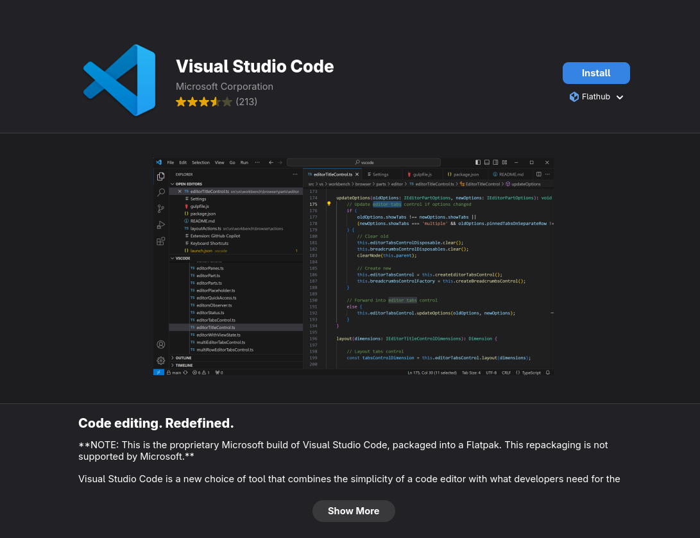

# Install Visual Studio Code on Fedora Linux

## Graphical method
To install Visual Studio Code on Fedora Linux using the graphical user interface (GUI), you can follow these steps (the flatpak method is not recommended as it may not receive updates as quickly as the official repository method, but it is included here for completeness):
1. Open the "Software" application from your applications menu.

2. Enable the "Flathub" repository if it is not already enabled. You can do this by clicking on the "Software Repositories" (ctrl + .) option in the settings menu and then enabling the "Flathub" repository.


3. In the search bar, type "Visual Studio Code" and press Enter.


4. Click on the Visual Studio Code application from the search results.

5. Click the "Install" button to start the installation process.

* You may be prompted to enter your password to authorize the installation. Enter your password and click "Authenticate" to proceed.


6. Wait for the installation to complete. Once it is finished, you can launch Visual Studio Code from your applications menu.

## Terminal method
To install Visual Studio Code on Fedora Linux, you can follow these steps:
1. Open a terminal window by searching for "Terminal" in your applications menu.

2. Install the key and yum repository by running the following script:
```bash
sudo rpm --import https://packages.microsoft.com/keys/microsoft.asc &&
echo -e "[code]\nname=Visual Studio Code\nbaseurl=https://packages.microsoft.com/yumrepos/vscode\nenabled=1\nautorefresh=1\ntype=rpm-md\ngpgcheck=1\ngpgkey=https://packages.microsoft.com/keys/microsoft.asc" | sudo tee /etc/yum.repos.d/vscode.repo > /dev/null
```

3. Then update the package cache and install the package using dnf (Fedora 22 and above):
```bash
dnf check-update
```
```bash
sudo dnf install code
```
* You will be prompted to confirm the installation of Visual Studio Code and any additional dependencies. Type "y" (or if "Y" is capitalized simply press enter) and press Enter to continue with the installation.

4. Wait for the installation to complete. Once it is finished, you can launch Visual Studio Code from your applications menu.

## After installation
When you launch Visual Studio Code for the first time, you should see the welcome screen with a startup guide (since the rest is mostly the same for all platforms, we will not go through it here, but you can find a separate guide for the setup):

