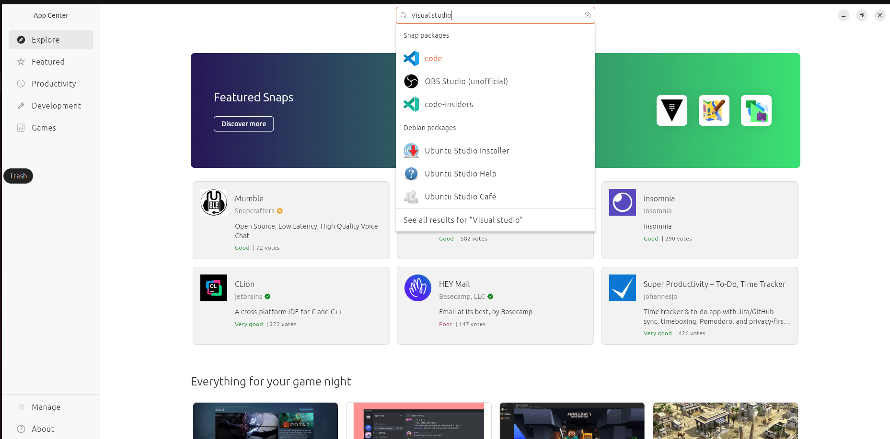
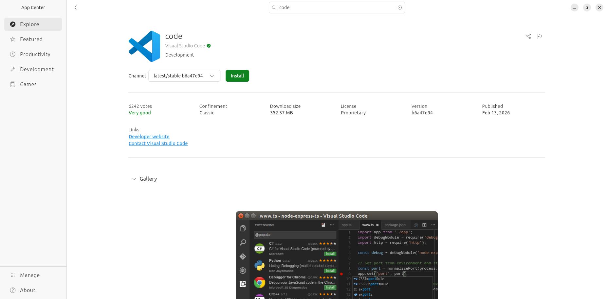
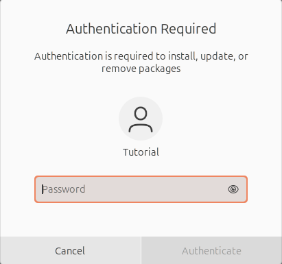

# Install Visual Studio Code on Ubuntu Linux

To install Visual Studio Code on Ubuntu Linux, you can either use the terminal or the graphical user interface (GUI). Here are the steps for both methods:

## Method 1: Using the App Center (GUI)
1. Open the "Ubuntu Software" application from your applications menu.

2. In the search bar, type "Code" and press Enter.


3. Click on the Visual Studio Code application from the search results.

4. Click the "Install" button to start the installation process.

	* You may be prompted to enter your password to authorize the installation. Enter your password and click "Authenticate" to proceed.3
	

5. Wait for the installation to complete. Once it is finished, you can launch Visual Studio Code from your applications menu.

## Method 2: Using snap package (Snap)
1. Open a terminal window by pressing Ctrl + Alt + T or by searching for "Terminal" in your applications menu.

2. Install Visual Studio Code using snap by running the following command:
```bash
sudo snap install code --classic
```

3. Wait for the installation to complete. Once it is finished, you can launch Visual Studio Code from your applications menu.
* When launching Visual Studio Code for the first time, it will open a document with a flatpak warning. This is normal and you can safely ignore it (if you don't care about the limitations). You can close the document and it will not appear again.
* If you want to see the welcome screen with the startup guide, you can open the command palette (Ctrl + Shift + P) and type "welcome" and select "Help: Show Welcome Page" to open it, or it is available in the "Help" menu at the top.

## Method 3: Using the Terminal (APT)
1. Open a terminal window by pressing Ctrl + Alt + T or by searching for "Terminal" in your applications menu.

2. Update the package index and install the necessary dependencies by running the following commands. The second command may not be necessary if you already have these packages installed, but it is good practice to ensure you have the latest versions. Since we use sudo you will be prompted to enter your password. You might also be prompted to confirm the installation of additional packages, type "y" (or if "Y" is capitalized simply press enter) and press Enter to continue:
```bash
sudo apt update
sudo apt install software-properties-common apt-transport-https wget
```

3. Import the Microsoft GPG key by running the following command:
```bash
wget -q https://packages.microsoft.com/keys/microsoft.asc -O- | sudo apt-key add -
```

4. Add the Visual Studio Code repository to your system by running the following command (for amd64 architecture, change "amd64" to "arm64" if you are using an ARM-based system):
```bash
sudo add-apt-repository "deb [arch=amd64] https://packages.microsoft.com/repos/vscode stable main"
```
* When you run this command, you may be prompted to confirm the addition of the repository. Press Enter to continue when prompted.

5. Update the package index again to include the new repository:
```bash
sudo apt update
```

6. Finally, install Visual Studio Code by running the following command:
```bash
sudo apt install code
```
* You should be prompted that the installation would like to add the Microsoft repository to your repository so you can update Visual Studio Code, by using apt, in the future. Select "Yes" to allow this, as it will make it easier to keep Visual Studio Code up to date in the future. If you select "No" (or you are not asked), you will need to manually add the repository later if you want to receive updates for Visual Studio Code through apt.

7. Wait for the installation to complete. Once it is finished, you can launch Visual Studio Code from your applications menu or by typing `code` in the terminal.

## After installation
If any of these items is correct for you:
1. It's your first time using the GNOME Keyring (or similar keyring service)

2. A new keyring needs to be created for the application

3. You've previously chosen not to create a keyring, and an application now requires one

Then you will be requested to choose a password for the new keyring that will be used to store your credentials and other secrets securely. You can choose to set a password or leave it blank if you prefer not to use a keyring. If you choose to set a password, make sure to remember it, as you will need it to access the stored credentials in the future. If you choose to leave it blank, your credentials will not be encrypted and may be less secure, but it will allow you to use Visual Studio Code without needing to enter a password each time.

When you launch Visual Studio Code for the first time, you should see the welcome screen with a startup guide (since the rest is mostly the same for all platforms, we will not go through it here, but you can find a separate guide for the setup):

