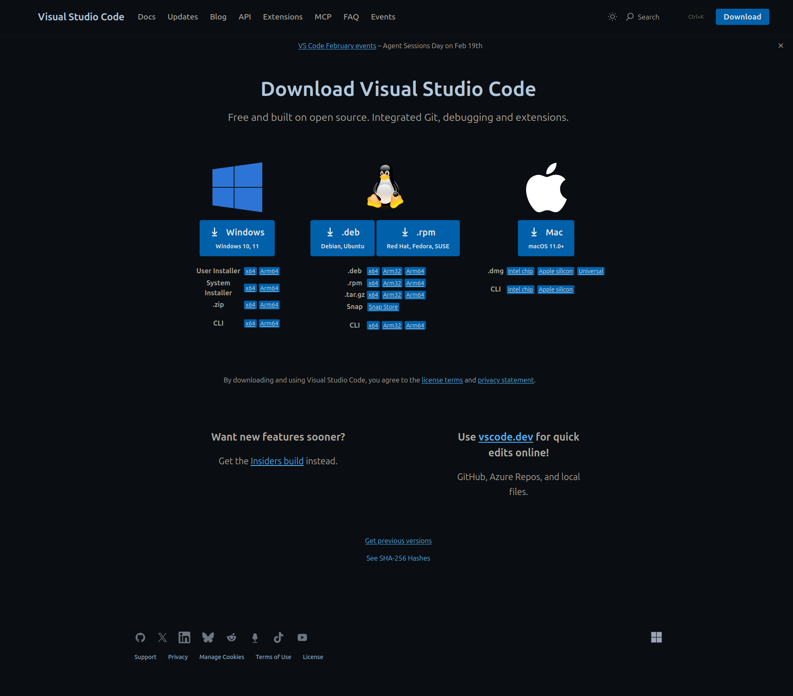
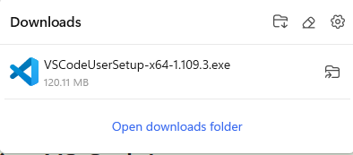
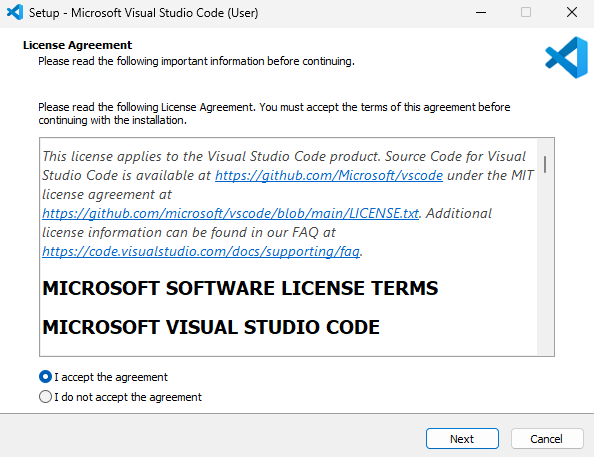
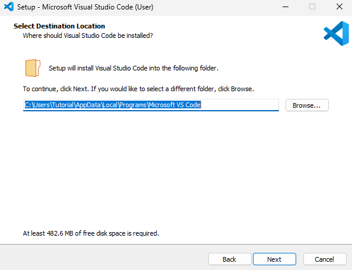
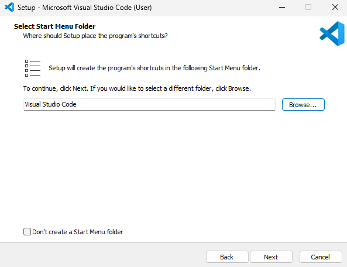
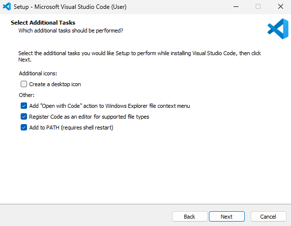
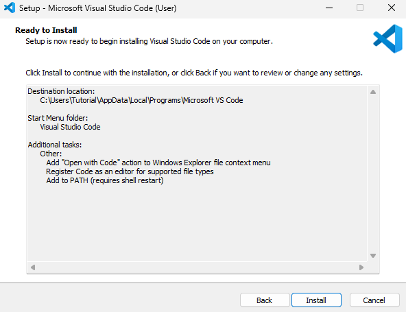
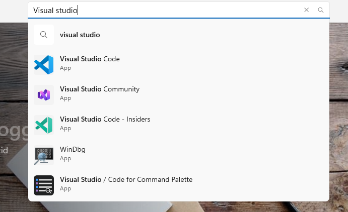
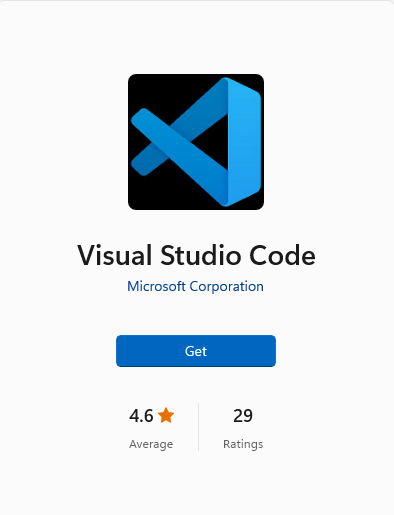
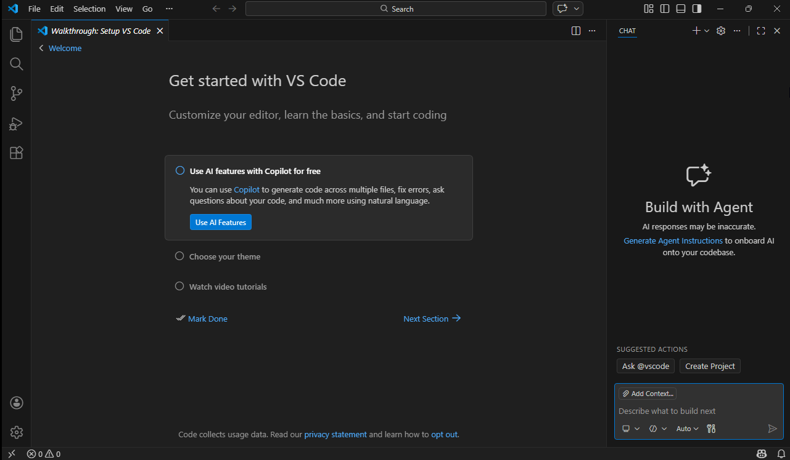

# Windows 11 Installation Guide for Visual Studio Code (This is tested on a clean install of Tiny 11 (striped down Windows 11), but it should be similar for older versions of Windows as well, though some steps may differ slightly)

## From website
To install Visual Studio Code on Windows 11, you can follow these steps:
1. Open your web browser and go to the official Visual Studio Code download website: https://code.visualstudio.com/download
2. Click on the Windows download button to download the installer (this should auto download).

	

3. Once the download is complete, open the installer file (usually named "VSCodeSetup-x64-VERSION.exe").

	

4. Double-click the installer to start the installation process. You may be prompted with a User Account Control (UAC) dialog asking for permission to make changes to your device. Click "Yes" to proceed.
5. Follow the on-screen instructions to complete the installation process. You can choose the default settings or customize the installation according to your preferences.
	1. You will be prompted with the License Agreement dialog. Click "I Accept" to accept the license terms (only if you agree to the terms). Then press "Next" to continue with the installation.

	

	2. Select the destination folder where you want to install Visual Studio Code. The default location is usually fine for most users (but it can be nice to note where it is located). Click "Next" to continue.

	

	3. Sellect the start menu folder where you want to create the Visual Studio Code shortcuts. The default is usually fine. Click "Next" to continue.

	

	4. You will be presented with additional tasks that you can choose to perform during the installation. These include options such as creating a desktop icon, adding "Open with Code" actions to the context menu, and more. The default options are usually fine for most users, but it can be nice to have the "Open with Code" options in the context menu for easier access to opening files and folders in Visual Studio Code. Select the options that you prefer and click "Next" to continue.

	

	5. Finally, you will see a summary of the installation settings you have chosen. Review the settings and click "Install" to start the installation process.

	

6. Wait for the installation to complete. Once it is finished, you can choose to launch Visual Studio Code immediately by checking the "Launch Visual Studio Code" option before clicking "Finish". Otherwise, you can launch it later from the Start menu or desktop shortcut if you created one. The startup process may take a few moments as Visual Studio Code initializes for the first time.
	* If the startup process takes a long time you can try restarting your computer and launching Visual Studio Code again, as this can sometimes help resolve any initial performance issues. There is also a chance it is not actually starting, this can be checked by looking for "Visual Studio Code" in the task manager (Ctrl + Shift + Esc) under the "Processes" tab. If it is listed there but you cannot see the window, try right-clicking on it and selecting "Maximize" or "Switch to" to bring it to the foreground.

## From Microsoft Store
To install Visual Studio Code on Windows 11 using the Microsoft Store, you can follow these steps:
1. Open the Microsoft Store application from your Start menu.
2. In the search bar at the top of the Microsoft Store, type "Visual Studio Code" and press Enter.

	

3. Click on the Visual Studio Code application from the search results.
4. Click the "Get" button to start the installation process.

	

5. Wait for the installation to complete. Once it is finished, you can launch Visual Studio Code from the Start menu or by searching for it in the Microsoft Store. ! This was not actually successfully tested, might be because I deleted edge (couldn't help myself) !

## After installation
When you launch Visual Studio Code for the first time, you should see the welcome screen with a startup guide (since the rest is mostly the same for all platforms, we will not go through it here, but you can find a separate guide for the setup):

	

If you want to follow the git tutorial provided in this repo, you will need to set up git in Visual Studio Code. You can find a separate guide for setting up git in Visual Studio Code here: [Git Setup Guide](../../Git/GitSetup.md)
