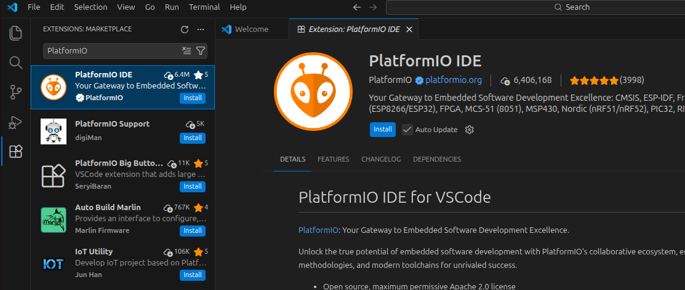
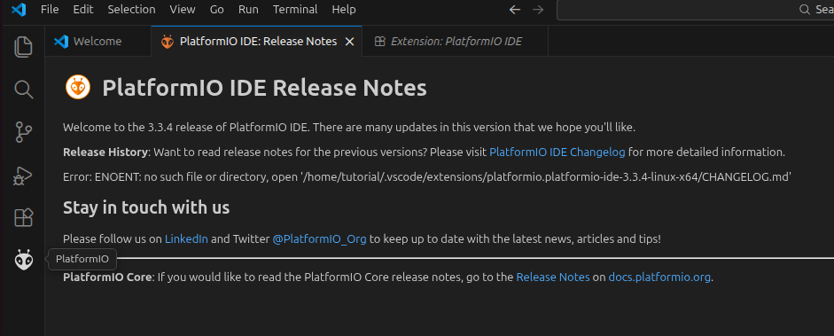
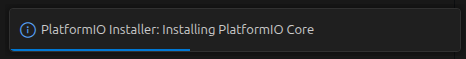
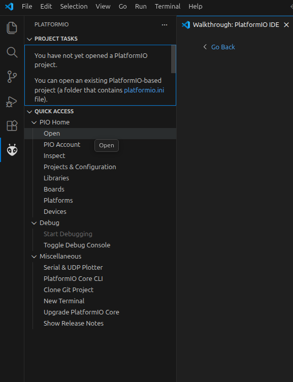

# Adding PlatformIO to Visual Studio Code

To add PlatformIO to Visual Studio Code, you can follow these steps:
1. Open Visual Studio Code.

2. Click on the Extensions icon in the left sidebar (or press Ctrl + Shift + X) to open the Extensions view.

3. In the search bar, type "PlatformIO" and press Enter.

4. Click on the "Install" button next to the PlatformIO extension in the search results (you will probably be asked if you trust the publisher).

5. Wait for the installation to complete. Once it is finished, you will see a new PlatformIO icon in the left sidebar of Visual Studio Code.

	* It still needs to install the PlatformIO Core, which is the command-line tool that powers the PlatformIO extension. You will see a notification in the bottom right corner of Visual Studio Code.
	

	* Wait for the installation of PlatformIO Core to complete. This may take a few minutes, depending on your internet connection and system performance. Once it is finished, you will see a notification confirming that PlatformIO Core has been installed successfully.
	* In some cases it might get stuck at "Installing PlatformIO Core" and not complete the installation. If this happens, you can try restarting Visual Studio Code and see if the installation completes after the restart. If you do not have python installed (or python venv is not initialized) you might also need to install python and initialize a python venv for the installation to complete. You can find instructions for installing python and initializing a python venv in the [Python Installation Guide](https://docs.platformio.org/en/latest/faq/install-python.html).
	* There is also a guide available thru the VsCode welcome page.

6. Click on the PlatformIO icon to open the PlatformIO Home page, where you can create new projects, manage libraries, and access other features of PlatformIO.

7. You can now start using PlatformIO to develop your embedded projects within Visual Studio Code. You can create new projects, manage libraries, and access other features of PlatformIO directly from the PlatformIO Home page. For more information on how to use PlatformIO, you can refer to the official documentation: [PlatformIO Documentation](https://docs.platformio.org/en/latest/) or by following the tutorial in this repository: [GettingStartedWithPlatformIO](../../../PlatformIO/GettingStartedWithPlatformIO.md).
