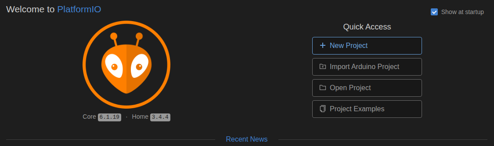
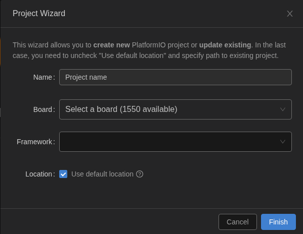
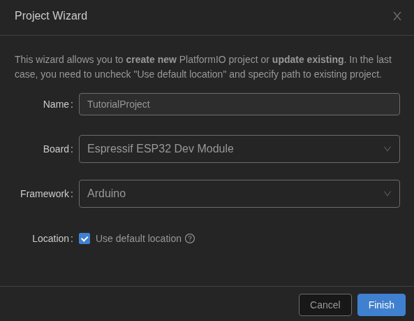
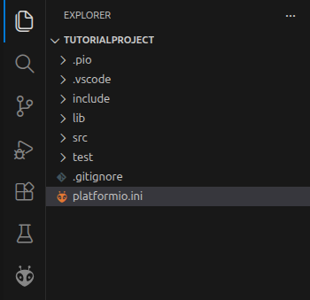
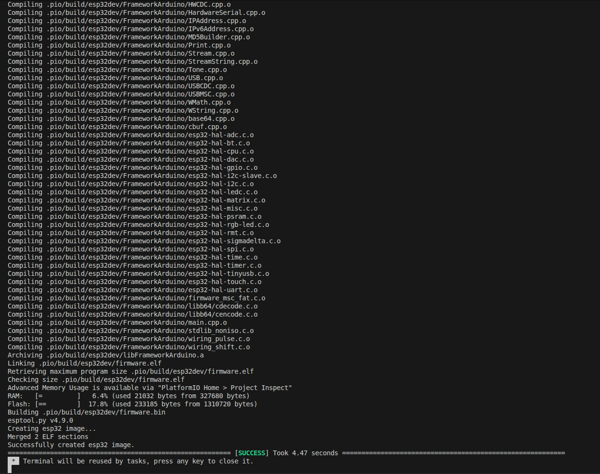

# Getting Started with PlatformIO

This guide will help you get started with PlatformIO. The guide will be written for Visual Studio Code, but the steps should be similar for other IDEs that support PlatformIO. And will assume that you have already installed PlatformIO in your IDE. If you have not yet installed PlatformIO, please refer to the corresponding guide for the IDE you are using (Visual Studio Code and CLion): [Guid for different editors](../EditorGuides).

# Create a New PlatformIO Project
1. Open your editor and click on the PlatformIO icon in the left sidebar to open the PlatformIO Home page.

2. Click on the "New Project" button to create a new project.

	

3. In the "New Project" dialog, enter a name for your project, select the board you are using, and choose the framework you want to use (e.g., Arduino, ESP-IDF, etc.). Click on the "Finish" button to create the project.

	

	* In this example, we will create a project for an ESP32 board using the Arduino framework.

	

4. After the project is created, you will see the project structure in the left sidebar. The main source code file is located in the "src" folder and is named "main.cpp". You can open this file to start writing your code.
	* You might be asked if you trust the authors of the project, select "Yes" to continue. If you select "No", you will need to manually add the project folder to your workspace in order to work on the project.
	* You can also also select to trust the author of the parent folder of the project, which will allow you to work on multiple projects within that folder without being asked to trust the author for each project. But this should not be done if you downloaded other projects from the internet to that folder, as it could be a security risk to trust the author of those projects.

	

5. You can now start writing your code in the "main.cpp" file, or use the code available in the file by default.

# Build and Upload the Firmware
1. To build your project, click on the checkmark icon in the bottom toolbar or press Ctrl + Alt + B. This will compile your code and generate the firmware binary.

	

	* The upload process (described below) should compile the code if it has not been compiled yet, so you can also click on the upload button to build and upload the firmware in one step. But building the project separately can be useful to check for compilation errors before uploading the firmware to your device.

2. To upload the firmware to your device, click on the right arrow icon in the bottom toolbar or press Ctrl + Alt + U. This will upload the compiled firmware to your device.
	* Make sure your device is connected to your computer and the correct port is selected in the PlatformIO settings before uploading the firmware.

# Monitor the Serial Output
1. To monitor the serial output from your device, click on the plug icon in the bottom toolbar or press Ctrl + Alt + S. This will open the serial monitor and display the output from your device.
	* Make sure the correct port and baud rate are selected in the PlatformIO settings to see the serial output from your device.

# The main differences between PlatformIO and the Arduino IDE when writing code for an Arduino-based board are:
1. Project Structure: PlatformIO uses a more organized project structure with separate folders for source code, libraries, and other resources. In contrast, the Arduino IDE typically uses a single folder for all project files.

2. Library Management: PlatformIO has a built-in library manager that allows you to easily install and manage libraries for your projects. The Arduino IDE also has a library manager, but it is not as powerful or flexible as the one in PlatformIO.

3. Build System: PlatformIO uses a more advanced build system that supports multiple platforms and frameworks, allowing you to easily switch between different development environments. The Arduino IDE is primarily designed for Arduino boards and does not support as many platforms or frameworks.

4. When actualy writing code, the syntax and APIs for the Arduino framework are the same in both PlatformIO and the Arduino IDE, so you can use the same code in both environments without much modification. You will however have access include the `#include <Arduino.h>` file in PlatformIO. The `Arduino.h` file includes the core Arduino functions and definitions, and is typically included in Arduino sketches to provide access to the Arduino API. In the Arduino IDE, this file is automatically included in your sketch.

## Overall
PlatformIO provides a more robust and flexible development environment compared to the Arduino IDE, making it a better choice for more complex projects or for developers who want to work with multiple platforms and frameworks. However, the Arduino IDE can still be a good choice for beginners or for simple projects that do not require the advanced features of PlatformIO.

# Conclusion
In this guide, we have covered the basics of getting started with PlatformIO, including how to create a new project, build and upload firmware, and monitor the serial output. We have also discussed the main differences between PlatformIO and the Arduino IDE when writing code for an Arduino-based board. With this knowledge, you should be able to start developing your own embedded projects using PlatformIO. For more information on how to use PlatformIO, you can refer to the official documentation: [PlatformIO Documentation](https://docs.platformio.org/en/latest/).