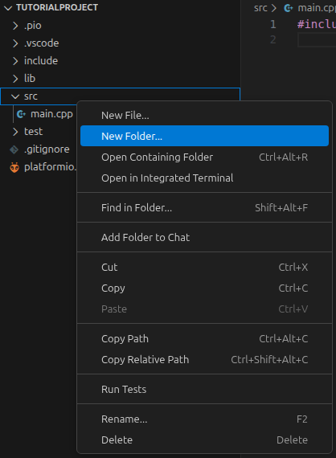
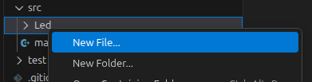
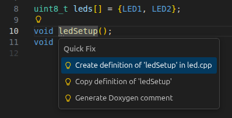
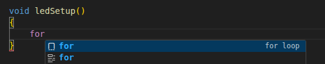
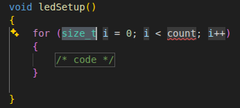

# Programming Tutorial for PlatformIO
This tutorial will guide you through the process of setting up and programming a microcontroller using PlatformIO, an open-source ecosystem for IoT development. This will build on the previous tutorial where we set up PlatformIO. But with actual programming. We will be using an ESP32 (esp32dev) microcontroller for this tutorial, but the steps should be similar for other microcontrollers supported by PlatformIO.

## Step 1: Create a New Project
1. Open your editor and click on the PlatformIO icon in the left sidebar to open the PlatformIO Home page.

2. Click on the "New Project" button to create a new project.


3. In the "New Project" dialog, enter a name for your project, select the board you are using, and choose the framework you want to use (e.g., Arduino, ESP-IDF, etc.). Click on the "Finish" button to create the project.


	* In this example, we will create a project for an ESP32 board using the Arduino framework.


4. After the project is created, you will see the project structure in the left sidebar. The main source code file is located in the "src" folder and is named "main.cpp". You can open this file to start writing your code.
	* You might be asked if you trust the authors of the project, select "Yes" to continue. If you select "No", you will need to manually add the project folder to your workspace in order to work on the project.
	* You can also also select to trust the author of the parent folder of the project, which will allow you to work on multiple projects within that folder without being asked to trust the author for each project. But this should not be done if you downloaded other projects from the internet to that folder, as it could be a security risk to trust the author of those projects.


5. You can now start writing your code in the "main.cpp" file, or use the code available in the file by default.

## Step 2: Write Your Code
To show some nice to have features we will goe thru writing a "simple" led control code. The focus is not on the actual operations in the code but rather how to write and organize the code.

1. We will start by looking at the "main.cpp" file. It has some example code with a function declaration and the functions definition at the bottom of the file. To start of we will remove everything in this fil except the `#include <Arduino.h>` line and empty setup and loop functions:
	```Arduino
	#include <Arduino.h>

	void setup()
	{

	}

	void loop()
	{

	}
	```

2. The next thing we can do is to create a new subfolder in the "src" folder That we name "Led".



3. Inside the "Led" folder create two files: one named "led.h" and one named "led.cpp".



4. Now that we have created the two files open the "led.h" file
	* A .h file is called a header file and tells the compiler about the functions and variables that are defined in the corresponding .cpp file. It is used to declare the interface of the code in the .cpp file, so that other parts of the code can use it without needing to know the implementation details.

5. Inside the "led.h" we will add the following lines:
	1. The first line `#pragma once` indicates to the compiler that this file only should be included once. It is necessary to avoid multiple declarations of the same things. The old convention was to use include guards, which is a preprocessor directive that checks if a unique identifier has been defined before. If it has not been defined, it defines the identifier and includes the contents of the file. If it has been defined, it skips the contents of the file. The `#pragma once` directive is a more modern and simpler way to achieve the same result. The old method look something like:
		```cpp
		#ifndef LED_H
		#define LED_H
		// ... contents of the file ...
		#endif // LED_H
		```
	2. The second line is the Arduino library mentioned earlier.
	3. Then we use `#define` to define two macros for the led pins we want to use. A rule of thumb is that every thing that starts with `#` is done at compile time (not actually running as a part of the compiled code). This means that every place where LED1 or LED2 is writen will be rewritten by the compiler to just contain the number.
	4. The next line creates and filles the leds array, this array is the type `uint8_t`. The `u` indicates that it is `unsigned` meaning it can not be negative. Then we see `int` that indicates it is a whole number (float and double can not be unsigned). Next part is the `8` indicating the amount of bits it contains (8 is the size of a `char` and a `bool`). Then finally have `_t` to indicate that it is a type.
	5. Followed by another `constexpr` named ladArrayLength. `constexpr` (introduced in C++ 11) tels the compiler that the value can be evaluated at compile time to save resources. In this instance you should se `constexpr size_t ledArrayLength = 2U` if you hover your mouse above the name of the variable.
	6. Next line is the declaration of the `ledSetup` function with the return type of `void`.
	7. Then we se the declaration of the `setAllLedsToState` function, this function also has the `void` return type but this function takes inn a `uint8_t` parameter named `state`.

	* The finished code:
		``` Arduino
		#pragma once

		#include <Arduino.h>

		#define LED1 31
		#define LED2 32

		constexpr uint8_t leds[] = {LED1, LED2};

		constexpr size_t ledArrayLength = sizeof(leds) / sizeof(leds[0]);

		void ledSetup();
		void setAllLedsToState(uint8_t state);
		```

6. After writing the lines above into the "led.h" file you should see three gray dots below the function declarations. By pressing `ctrl + .` or pressing the yellow lightbulb, when your indicator is on the function name, you should get the `Create definition of 'ledSetup' in led.cpp` prompt. This will automatically create the definition of the function in the "led.cpp" file. The "Quick Fix" menu is used for many features and is worth taking a look at.

	

7. After creating the definitions of the two function we should have the folowing "led.cpp" file (or something simulare):
	```Arduino
	#include "led.h"

	void ledSetup()
	{
	}

	void setAllLedsToState(uint8_t state)
	{
	}
	```

8. Now we can simply write the actual code for the functions. Both codes needs to go thru the led array to run the necessary functions with the corresponding pin numbers. So both run a `for loop`. When you start to write `for` you should se the following, and is called a code snippet (if your system is slow it might be slightly delayed):

	

	If you press tab it should give you a pre-written for loop that you can rewrite to your specification. Some of the parts will be highlighted. Use `tab` to navigate to the next item and rewrite as you wish (`shift + tab` so step back):

	

   When we are finished it should look something like:
	```Arduino
	void ledSetup()
	{
		for (size_t i = 0; i < ledArrayLength; i++)
		{
			pinMode(leds[i], OUTPUT);
		}
	}

	void setAllLedsToState(uint8_t state)
	{
		for (size_t i = 0; i < ledArrayLength; i++)
		{
			digitalWrite(leds[i], state);
		}
	}
	```

10. Let us go back to the "main.cpp" file. The "main.cpp" file is where the compiler actually looks to find what it needs to compile, that means non of the code we have written this fare would be uploaded to the microcontroller. To fix this we tell the compiler that we want to access the led "library" we have created. This can be done by simply including the header file using the following: `#include "Led/led.h"` (`<>` and `""` have no practical difference but `""` can indicate that it is a local library or something you mess with). Now that we have included the necessary file we can use our functions as normal:
	```Arduino
	#include <Arduino.h>
	#include "Led/led.h"

	void setup()
	{
		ledSetup();
	}

	void loop()
	{
		setAllLedsToState(HIGH);
		delay(1000);
		setAllLedsToState(LOW);
		delay(1000);
	}
	```

## Uploading the Code
Now that we have written the code we can upload it to our microcontroller. This step is described in the different guides about PlatformIO.

# Some useful features (should work in most editors) 
The features tested on Visual Studio Code on a Ubuntu based system, but most of these features should work in other editors as well, although the shortcuts might be slightly different. It is worth looking into the documentation of your editor to find out what features it has and how to use them. Most editors have a shortcut menu where you can find the correct shortcuts for your editor. Contributions from users that have tested these features on other editors are also welcome.

1. Go to definition: If your cursor is on a function or variable name you can press `F12` to go to the definition of that function or variable. This works across files, so if you are in the "main.cpp" file and your cursor is on the `ledSetup` function, pressing `F12` will take you to the definition of that function in the "led.cpp" file. This can be very useful when you have a large codebase and you want to quickly navigate to the definition of a function or variable or you want to explore a library.

2. Commenting and uncommenting code: You can quickly comment or uncomment a line of code by placing your cursor on the line and pressing `Ctrl + *`. This will add `//` at the beginning of the line to comment it out, or remove `//` if the line is already commented. You can also select multiple lines and press `Ctrl + *` to comment or uncomment all the selected lines at once. Although some editors might not support this shortcut, but might support pressing `Ctrl + k` followed by `Ctrl + c` to comment and `Ctrl + k` followed by `Ctrl + u` to uncomment.

3. Code formatting: You can automatically format your code by pressing `Shift + Alt + F` (on some systems it might be `Ctrl + Shift + I`). This will format your code according to the rules defined in your editor's settings. This can be very useful to keep your code clean and readable, especially when working with a team where everyone might have different coding styles. You can also configure your editor to automatically format your code on save, so you don't have to remember to do it manually.

4. Auto-completion: Most editors have an auto-completion feature that suggests completions for functions, variables, and other code constructs as you type. This can be very useful to speed up your coding and reduce typos. For example, when you start typing `ledS`, you might see a suggestion for `ledSetup` that you can select (`enter` or `tab`) to automatically complete the function name.

5. Auto save: You can configure your editor to automatically save your code after a certain period of time or when you switch to another file. This can be very useful to prevent losing your work in case of a crash or power outage.

6. Cut out entire line without selecting it: You can quickly cut out an entire line of code by placing your cursor on the line and pressing `Ctrl + x`. This will cut the entire line and move the lines below it up. This can be very useful when you want to quickly remove a line of code without having to select it first. It will also work to cut out what you have selected, so if you have a part of the line selected it will only cut that part. You can also use `Ctrl + Shift + k` to delete the entire line without copying it to the clipboard.

7. Multi-cursor editing: To create multiple cursors for editing, you can hold down the `Alt` key and click in different places in your code, or in some instances use `Ctrl + Shift + Down Arrow` or `Ctrl + Shift + Up Arrow` to place additional cursors abowe or belowe the current cursor. This can be very useful when you want to make the same change to multiple lines of code, such as renaming a variable or adding a comment to multiple lines.

8. Code snippets (mentioned above): Many editors have a code snippet feature that allows you to quickly insert commonly used code constructs. For example, you might have a snippet for a `for loop` that you can trigger by typing `for` and pressing `Tab`. This can be very useful to speed up your coding and reduce the amount of boilerplate code you have to write.

9. Refactoring: Many editors have refactoring tools that allow you to easily rename variables (often using `F2`), extract functions, and perform other common refactoring tasks. This can be very useful to improve the structure of your code without having to manually make all the necessary changes. For example, if you want to rename a variable, you can place your cursor on the variable name and use the refactoring tool to rename it, and it will automatically update all occurrences of that variable in your code.

10. Navigation and marking code:
	1. Holding in `Ctrl` and using the arrow keys allows you to quickly navigate through your code. `Ctrl + Left Arrow` and `Ctrl + Right Arrow` will move your cursor to the beginning of the previous or next word, respectively. This can be very useful to quickly navigate through your code without having to use the mouse.
	3. You can also use `PageUp` and `PageDown` to quickly navigate to the beginning or end of the file, respectively. This can be very useful when working with large files.
	4. You can also use `Shift` in combination with the navigation keys above to quickly select code. For example, `Ctrl + Shift + Left Arrow` will select the previous word. This can be very useful to quickly select code for copying, cutting, or formatting.
 	5. Moving lines of code: You can quickly move lines of code up or down by placing your cursor on the line and pressing `Alt + Up Arrow` or `Alt + Down Arrow` (or selecting multiple lines and using the same keys). This will move the line of code up or down without having to cut and paste it. This can be very useful when you want to quickly rearrange your code.

# Conclusion
In this tutorial, we have gone through the process of creating a new project in PlatformIO,writing code in a structured way using header and source files, and how to use some of the features of the editor to make writing code easier. We have also discussed how to include our own libraries in our main code. With this knowledge, you should be able to start writing your own code for your microcontroller using PlatformIO. For more information on how to use PlatformIO, you can refer to the official documentation: [PlatformIO Documentation](https://docs.platformio.org/en/latest/).
